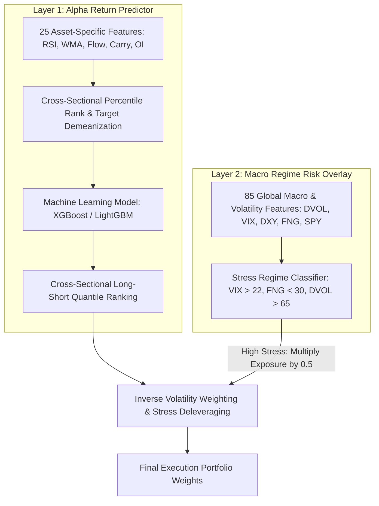

# Multifactor Portfolio Quantitative Trading Strategy

[](https://www.python.org/)
[](https://opensource.org/licenses/MIT)
[](https://github.com/psf/black)

An advanced, production-grade **Two-Layered Machine Learning & Quantitative Portfolio Strategy** designed for cryptocurrency futures markets. The strategy combines cross-sectional alpha return prediction with a global macro regime risk control overlay to generate market-neutral alpha while protecting capital during market stress.

---

## 🌟 Architecture Overview

The strategy operates using a modular **Two-Layered Architecture**:



### 1. Layer 1: Alpha Return Prediction (Asset-Level ML Model)
* **Universe**: Top 40 liquid Binance Futures cryptocurrencies.
* **Features**: 25 coin-level momentum, liquidity, funding carry, and margin risk indicators computed across 5 lookback windows $\{7, 14, 30, 60, 90\}$ days.
* **Normalization**: Daily Cross-Sectional Percentile Ranking $[0, 1]$ and Market Beta Target Demeanization ($y'_{i,t} = y_{i,t} - \bar{y}_t$).
* **Models**: XGBoost & LightGBM Regressors.

### 2. Layer 2: Global Macro Regime Risk Control (Macro Overlay)
* **Macro Inputs**: Deribit Implied Volatility (DVOL BTC/ETH), CBOE VIX, DXY Index, SPY, Crypto Fear & Greed Index, and Total Stablecoin Market Cap.
* **Dynamic Exposure Control**: Automatically scales portfolio position sizes by `stress_multiplier = 0.5` during market-wide panic regimes (`VIX > 22`, `FNG < 30`, `DVOL > 65`).

---

## 📁 Repository Structure

```
multifactor_portfo/
├── .github/
│   ├── workflows/ci.yml           # Automated CI/CD pipeline
│   ├── PULL_REQUEST_TEMPLATE.md   # GitHub PR template
│   └── ISSUE_TEMPLATE/            # Bug report and feature request templates
├── data/                          # Cached market data CSVs
├── multifactor_portfolio/
│   ├── optimization/
│   │   └── optuna_kernel.py       # Optuna hyperparameter tuning kernel
│   ├── register/
│   │   └── register_model.py     # MLflow PyFunc model serving wrapper
│   ├── research/
│   │   ├── feature_analysis.py    # OLS, MI Score & XGBoost Gain feature selector
│   │   └── selected_features.json # Selected active asset features
│   ├── training/
│   │   ├── train.py               # Walk-Forward Out-Of-Sample backtesting engine
│   │   ├── train_mlflow.py        # MLflow model training and tracking pipeline
│   │   └── test_train.py          # Unit test suite
│   └── util/
│       ├── data_collector.py      # Binance futures data downloader
│       ├── factors.py             # Cross-sectional factor calculation engine
│       ├── macro_collector.py     # Deribit, Yahoo Finance, FNG & DefiLlama macro API fetcher
│       ├── metrics.py             # CAGR, Sharpe, Drawdown performance metrics
│       └── rebalance.py           # Inverse Volatility weighting & portfolio backtest
├── .env.example                   # Sample environment variable file
├── .gitignore                     # Git ignore rules
├── .pre-commit-config.yaml        # Pre-commit hooks for linting & formatting
├── CONTRIBUTING.md                # Open-source contribution guidelines
├── docker-compose.yml             # Docker composition config
├── Dockerfile                     # Docker environment definition
├── LICENSE                        # MIT License
├── parameters.json                # Central strategy configuration parameters
└── README.md                      # Strategy documentation
```

---

## ⚙️ Quick Start & CLI Usage

### Prerequisites
* Python `3.11` or `3.12`
* [Poetry](https://python-poetry.org/) dependency manager

### Installation
```bash
git clone https://github.com/your-org/multifactor_portfo.git
cd multifactor_portfo
poetry install
```

### 1. Run Feature Selection & Analysis
Computes feature statistical relevance (OLS P-value, Mutual Information, XGBoost Gain) and extracts active asset-level features:
```bash
PYTHONPATH=. poetry run python -m multifactor_portfolio.research.feature_analysis
```

### 2. Execute Walk-Forward Training & MLflow Model Registration
Trains the machine learning pipeline under Walk-Forward Out-Of-Sample validation and logs metrics to MLflow:
```bash
PYTHONPATH=. poetry run python -m multifactor_portfolio.training.train_mlflow
```

### 3. Run Optuna Hyperparameter Optimization
Runs automated hyperparameter tuning using Optuna:
```bash
PYTHONPATH=. poetry run python -m multifactor_portfolio.optimization.optuna_kernel
```

### 4. Run Unit Tests
```bash
poetry run pytest multifactor_portfolio/training/test_train.py
```

---

## 🛠️ Configuration (`parameters.json`)

Key strategy parameters are dynamically loaded from `parameters.json`:

```json
{
  "features": {
    "model_type": "xgboost",
    "learning_rate": 0.02,
    "max_depth": 3,
    "num_boost_round": 80,
    "colsample_bytree": 0.3
  },
  "dataset": {
    "asset_class": "crypto",
    "universe_name": "binance_daily",
    "top_n_symbols": 40,
    "quantbt_repo_path": "/root/bobby/pool_alpha/quantbt"
  },
  "training": {
    "split_mode": "walk_forward_2024",
    "fee": 0.0005,
    "allocation_cap": 0.1,
    "lag": 1,
    "quantiles": 40,
    "inverse_vol_period": 120,
    "stress_vix_threshold": 22.0,
    "stress_fng_threshold": 30.0,
    "stress_dvol_threshold": 65.0,
    "stress_multiplier": 0.5
  }
}
```

---

## 🤝 Contributing

Contributions are welcome! Please read [CONTRIBUTING.md](CONTRIBUTING.md) for details on code style, branch naming, and pull request procedures.

---

## 📄 License

This project is licensed under the MIT License - see the [LICENSE](LICENSE) file for details.
