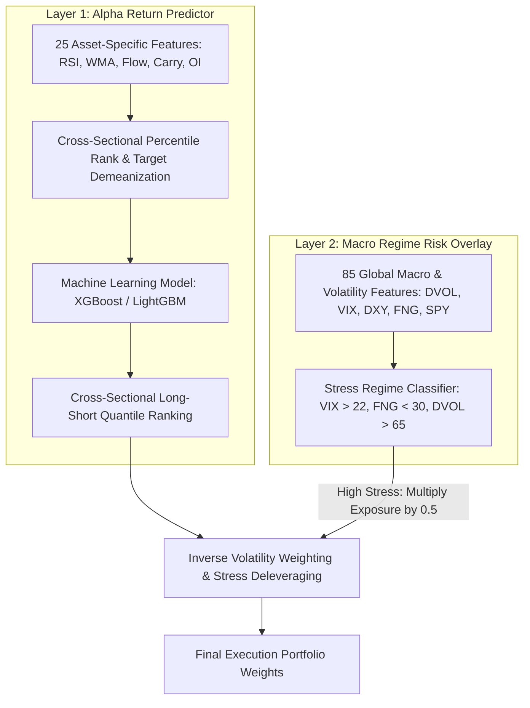

# Multifactor Portfolio Quantitative Trading Strategy

[](https://www.python.org/)
[](https://opensource.org/licenses/MIT)
[](https://github.com/psf/black)

An advanced, production-grade **Two-Layered Machine Learning & Quantitative Portfolio Strategy** designed for cryptocurrency futures markets. The strategy combines cross-sectional alpha return prediction with a global macro regime risk control overlay to generate market-neutral alpha while protecting capital during market stress.

---

## 🌟 Architecture Overview

The strategy operates using a modular **Two-Layered Architecture**:



### 1. Layer 1: Alpha Return Prediction (Asset-Level ML Model)
* **Universe**: Top 40 liquid Binance Futures cryptocurrencies.
* **Features**: 25 coin-level momentum, liquidity, funding carry, and margin risk indicators computed across 5 lookback windows $\{7, 14, 30, 60, 90\}$ days.
* **Normalization**: Daily Cross-Sectional Percentile Ranking $[0, 1]$ and Market Beta Target Demeanization ($y'_{i,t} = y_{i,t} - \bar{y}_t$).
* **Models**: XGBoost & LightGBM Regressors.

### 2. Layer 2: Global Macro Regime Risk Control (Macro Overlay)
* **Macro Inputs**: Deribit Implied Volatility (DVOL BTC/ETH), CBOE VIX, DXY Index, SPY, Crypto Fear & Greed Index, and Total Stablecoin Market Cap.
* **Dynamic Exposure Control**: Automatically scales portfolio position sizes by `stress_multiplier = 0.5` during market-wide panic regimes (`VIX > 22`, `FNG < 30`, `DVOL > 65`).

---

## 📁 Repository Structure

```
multifactor_portfo/
├── .github/
│   └── workflows/ci.yml           # Automated CI (canonical tests/ suite)
├── data/                          # Cached macro + funding CSVs (gitignored)
├── src/multifactor_mlops/         # CANONICAL pipeline (v4)
│   ├── config/                    # Strict 1:1 Pydantic schema + loader
│   ├── data/                      # OHLCV/macro/funding loaders
│   ├── features/                  # Asset features, macro overlay, panel, preprocessor
│   ├── labels/                    # Open-to-open labels + purge
│   ├── optimization/              # Stage 1 ML tuning, Stage 2 strategy tuning, folds
│   ├── pipelines/                 # OOF generation, single-touch OOS evaluation, fit_final
│   ├── portfolio/                 # Weights constructor + shared stress overlay
│   ├── backtest/                  # QuantBT native walk-forward adapter + runner
│   ├── tracking/                  # MLflow/run manifests
│   └── register/                  # Production bundle export
├── tests/                         # Canonical test suite (phase1-3 + v4)
├── scratch/                       # Isolated verification experiments
├── artifacts/                     # Locked tuned configs + final OOS results
├── parameters.json                # Master config (immutable, tuned params live in artifacts/)
├── .env.example                   # Sample environment variable file
├── .gitignore                     # Git ignore rules
├── .pre-commit-config.yaml        # Pre-commit hooks for linting & formatting
├── CONTRIBUTING.md                # Contribution guidelines
├── Dockerfile                     # Bundle verification container
├── LICENSE                        # MIT License
└── README.md                      # Strategy documentation
```

---

## ⚙️ Quick Start & CLI Usage

### Prerequisites
* Python `3.11` or `3.12`
* [Poetry](https://python-poetry.org/) dependency manager

### Installation
```bash
git clone https://github.com/your-org/multifactor_portfo.git
cd multifactor_portfo
poetry install
```

### 1. Stage 1 — ML Hyperparameter Tuning (dev window only, rank IC objective)
```bash
poetry run python -m src.multifactor_mlops.optimization.stage1_ml_tuning --trials 30
# -> artifacts/model_config.json (locked)
```

### 2. Generate OOF Predictions (dev window)
```bash
poetry run python -m src.multifactor_mlops.pipelines.generate_oof_predictions
# -> artifacts/oof_predictions.csv + fold_metrics.json
```

### 3. Stage 2 — Strategy & Risk Overlay Tuning (dev window only, QuantBT backtest)
```bash
poetry run python -m src.multifactor_mlops.optimization.stage2_strategy_tuning --trials 15
# -> artifacts/strategy_config.json (locked)
```

### 4. Single-Touch Outer OOS Evaluation (2024-01-01 →)
```bash
poetry run python -m src.multifactor_mlops.pipelines.evaluate_final --oos-start 2024-01-01
# -> artifacts/final_oos_metrics.json + final_oos_report.md
```

### 5. Export Production Bundle (model + preprocessor + overlay)
```bash
poetry run python -m src.multifactor_mlops.register.export_bundle --training-cutoff 2023-12-31
# -> artifacts/model_bundle/
```

### 6. Run Unit Tests
```bash
poetry run pytest tests/ -q
```

---

## 🛠️ Configuration (`parameters.json`)

Key strategy parameters are dynamically loaded from `parameters.json`:

```json
{
  "features": {
    "model_type": "xgboost",
    "learning_rate": 0.02,
    "max_depth": 3,
    "num_boost_round": 80,
    "colsample_bytree": 0.3
  },
  "dataset": {
    "asset_class": "crypto",
    "universe_name": "binance_daily",
    "top_n_symbols": 40,
    "quantbt_repo_path": "/root/bobby/pool_alpha/quantbt"
  },
  "training": {
    "split_mode": "walk_forward_2024",
    "fee": 0.0005,
    "allocation_cap": 0.1,
    "lag": 1,
    "quantiles": 40,
    "inverse_vol_period": 120,
    "stress_vix_threshold": 22.0,
    "stress_fng_threshold": 30.0,
    "stress_dvol_threshold": 65.0,
    "stress_multiplier": 0.5
  }
}
```

---

## 🤝 Contributing

Contributions are welcome! Please read [CONTRIBUTING.md](CONTRIBUTING.md) for details on code style, branch naming, and pull request procedures.

---

## 📄 License

This project is licensed under the MIT License - see the [LICENSE](LICENSE) file for details.
